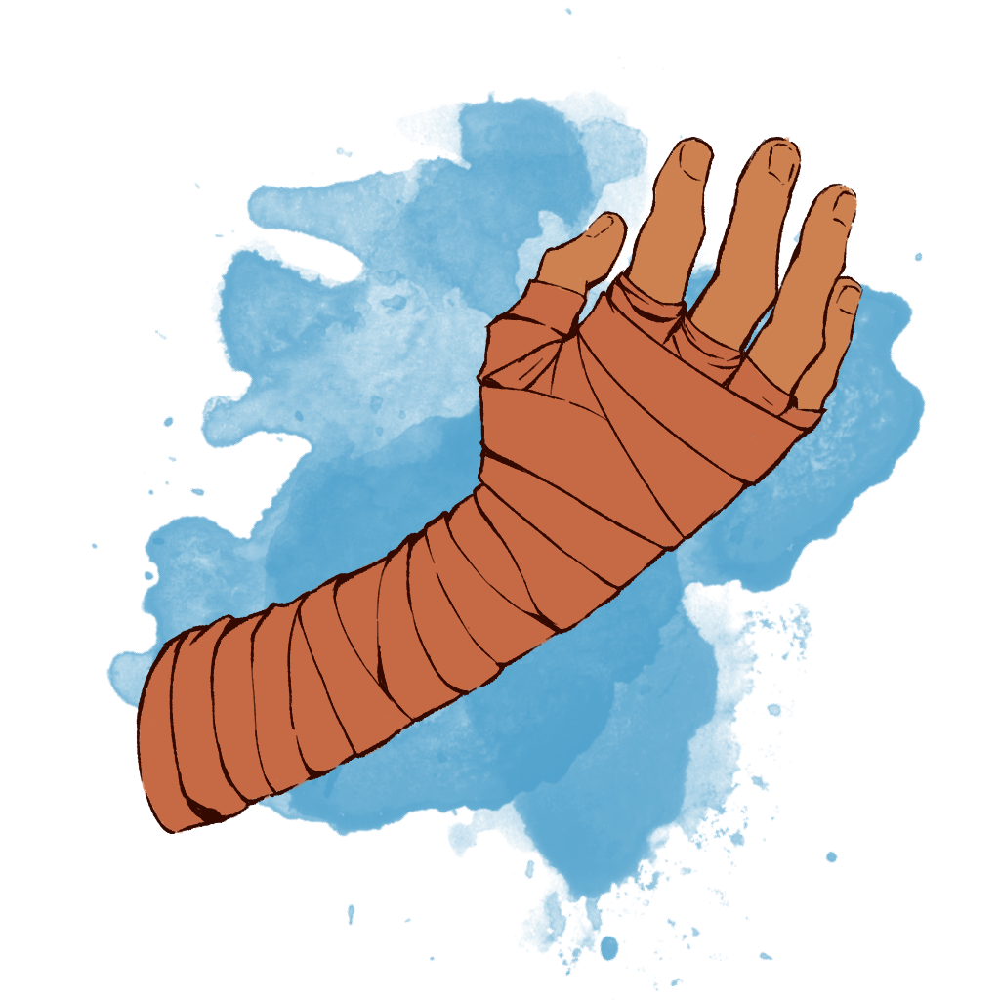

# Champion Relics

The **Champion Relics** are a series of powerful magical artifacts imbued with the spirits of great warriors who once protected the Soul Moon from an incursion of fiends. The items await new champions to take up arms against future threats, so that the original warriors can impart their power and wisdom to the next generation of protectors.

## Common Properties

The Champion Relics all include the following shared properties. A creature Attuned to a Champion Relic can access these properties in addition to a Relic's other properties.

_**Heroic Knowledge.**_ This relic retains all living knowledge of the hero who inhabits it, and can impart you with knowledge of that hero's adventures in ancient times. Once per day, if you spend 10 minutes touching the relic and mentally communing with the soul within, you can cast the _commune_ spell without any material components, targeting the hero as the divine proxy.

_**Sentience.**_ This relic is a sentient artifact; its alignment and ability scores are listed in its attributes. It is unable to sense its surroundings beyond its wielder. The relic can understand Common and can communicate with its wielder telepathically. While you are Attuned to this relic, it also understands every language you know.

## Relic Descriptions

Champion Relics are listed alphabetically.

## Dworb

#### Attributes

_Wondrous item, artifact (requires Attunement by a wizard), neutral good_

|  INT  |  WIS  |  CHA  |
|:-----:|:-----:|:-----:|
|20 (+5)|10 (+0)|10 (+0)|

While using the _dworb_ as a focus, your spells gain a +1 to their attack rolls and saving throw DCs; this bonus increases to +2 when you reach 9th level, and +3 when you reach 16th level. The _dworb_ has the following additional properties.

_**Shared Arcana.**_ The _dworb_ grants you the benefits of Galnar's extensive research into the arcane. The Relic has 5 charges that can be spent on some of its properties, and it regains 1d6 charges at dawn.

_**Transmuted Spell.**_ Galnar's studies of sorcerous metamagic taught him how to convert elemental energies through quick precise adjustments while casting a spell. While using the _dworb_ as a focus, when you cast a spell that deals a type of damage from the following list, you can expend 1 charge to change that damage type to one of the other listed types: acid, cold, fire, lightning, poison, thunder.

_**Cross-Class Studies.**_ Galnar learned how to reproduce divine, primal, and chaos magic using sophisticated arcane techniques. While using the _dworb_ as a focus, you can expend 1 charge to cast one of the following spells using the _dworb_ as if it were a wizard spell you knew: _antilife shell, bless, chaos bolt, enhance ability, faerie fire, insect plague, mass healing word, mass cure wounds,_ and _wind wall_. You must expend a spell slot of the appropriate level to cast a spell in this manner.

_**Personality.**_ The _dworb_ contains the soul of Galnar Thunderfist, a Hero of great mental skill and magical ability who agreed to grant his life knowledge to the relic so that he might help guide some future arcanist protecting the Soul Moons from fiendish invasion. Galnar was a reclusive mage in life, stubborn in his ways and certain to the superiority of his knowledge, but he will share his arcane discoveries through the _dworb_ if in the hands of a mage who respects his accomplishments.

## Johna

#### Attributes

_Weapon (greatsword), artifact (requires Attunement), lawful good_

|  INT  |  WIS  |  CHA  |
|:-----:|:-----:|:-----:|
|10 (+0)|10 (+0)|20 (+5)|

You gain a +1 to attack and damage rolls made with this magic weapon; this bonus increases to +2 when you reach 9th level, and +3 when you reach 16th level. The weapon has the following additional properties.

_**Shared Divine Light.**_ Johna's spirit shares her divine power with the greatsword's wielder. The greatsword has 5 charges that can be spent on some of the weapon's properties, and it regains 1d6 charges at dawn.

_**Divine Smite**_. When you hit a creature with _Johna_, you can expend 1-5 of her charges to deal Radiant damage to the target, in addition to the weapon's damage. The extra damage is 2d8 for 1 charge, plus 1d8 for each additional charge spent. The damage increases by 1d8 if the target is an Undead or a Fiend, to a maximum of 6d8.

_**Personality.**_ This relic contains the soul of Johna Cildonn, a powerful Hero who opted to imbue her sword with her essence to help guide future adventurers protecting the Soul Moon from fiendish threats. In life, Johna was a devoted paladin who was driven by her faith and channeled holy power to strike out against the Incursion of the Hells. So compelled was she to carry out good deeds in the name of her faith, her fellow Heroes sometimes described her as a "goody two-shoes".

## Silent Singer

#### Attributes

_Weapon (rapier), artifact (requires Attunement by a bard), chaotic good_

|  INT  |  WIS  |  CHA  |
|:-----:|:-----:|:-----:|
|20 (+5)|10 (+0)|10 (+0)|

You gain a +1 to attack and damage rolls made with this magic weapon; this bonus increases to +2 when you reach 9th level, and +3 when you reach 16th level. The weapon has the following additional properties.

_**Shared Inspiration.**_ The _Silent Singer_ grants you a portion of Ganu's power and creativity. The rapier has 5 charges that can be spent on some of the weapon's properties. These charges can also be used as Bardic Inspiration, and you can spend and combine them with any uses of Bardic Inspiration you already have from another source. The rapier regains 1d6 charges at dawn, but you can also expend uses of Bardic Inspiration in place of charges.

_**Song of the Blade.**_ Attacks made with the _Silent Singer_ use your Charisma modifier for the attack and damage rolls instead of Strength or Dexterity. Additionally, once on each of your turns when you hit a target with the _Silent Singer_, you can expend up to 5 charges, roll a number of Bardic Inspiration die equal to the number of charges spent, and choose one of the following secondary effects:

- **Sneak Attack.** You deal additional weapon damage equal to the roll.
- **Mocking Attack.** The target subtracts the number rolled from the next saving throw they make before the start of your next turn.

_**Personality.**_ The _Silent Singer_ contains the soul of Ganu Frightfrightener, a great Hero who voluntarily embodied this weapon to pass on his wisdom to adventurers protecting the Soul Moon. Ganu was a creative soul who was forced by the Incursion of the Hells to relinquish his love of music and art, instead being keyholed into the more "useful" role of a rogue, but his desire to contribute to the act of artistic expression draws the blade to connect with creative individuals.

#### Description

A steel rapier, crafted with brass and onyx, once wielded by the roguish member of the ancient party of Heroes who fought against an incursion of the Hells. The intricacies of this blade befits well the nature of this Hero, a goliath by the name of Ganu.

## Wraps of Angelo

<figure>
  
  <figcaption>Wraps of Angelo by <a href="https://twitter.com/200dollarHaru">Haru</a></figcaption>
</figure>

#### Attributes

_Wondrous item, artifact (requires Attunement by a monk), chaotic good_

|  INT  |  WIS  |  CHA  |
|:-----:|:-----:|:-----:|
|10 (+0)|20 (+5)|10 (+0)|

You gain a +1 to attack and damage rolls made using your Unarmed Strikes while wearing the _Wraps of Angelo_; this bonus increases to +2 when you reach 9th level, and +3 when you reach 16th level. The wraps have the following additional properties.

_**Psionic Entanglement.**_ The _Wraps of Angelo_ cannot be moved more than 10 feet apart from each other and are considered to be a single magic item.

_**Shared Discipline.**_ The _Wraps of Angelo_ grant you a portion of Angelo's power and mental discipline. The wraps have 5 charges that can be spent on some of the wrap's properties. These charges can also be used as Discipline Points, and you can spend and combine them with any Discipline Points you already have from another source. The wraps regain 1d6 charges at dawn, but you can also use your Discipline Points in place of charges.

_**Infused Strikes.**_ You can enhance your attacks with psionic energy. Each time you hit a creature with an Unarmed Strike, you Grapple a creature, or a creature fails a check to escape your Grapple, you can choose to expend up to 3 charges and roll that number of Martial Arts dice. You deal psychic damage to the target of your Grapple or attack equal to the number rolled.

_**Reactive Healing.**_ You gain the ability to redirect the power of strikes and magical harm into healing energy. As a Reaction when you take damage from a weapon or spell, you can expend up to 5 charges and roll that number of Martial Arts dice. You regain a number of Hit Points equal to the number rolled plus your Wisdom modifier.

_**Personality.**_ The wraps contain the soul of Angelo, a great hero who voluntarily embodied this artifact to pass on his wisdom to adventurers protecting the Soul Moon. Like Angelo himself, the wraps are driven to strike down fiends without parley.

#### Description

These sienna hand wraps were once worn by a powerful tortle monk named Angelo, who fought alongside the greatest Heroes of the Soul Moon to hold back an invasion of devils during the Incursion of the Hells. When this battle was won, the warrior imparted his consciousness into the wraps, to act as counsel should a new champion be called into action to stop a future catastrophe.

The wraps appear simple and utilitarian, but they faintly crackle with psionic energy that sharply hones the wielder's mind. This energy also binds the two pieces of cloth together, such that they cannot be separated as long as their magic is intact.
