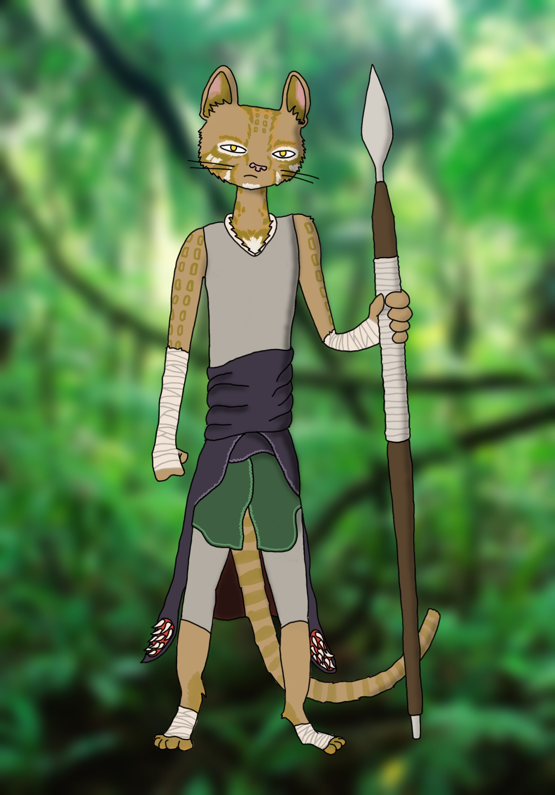
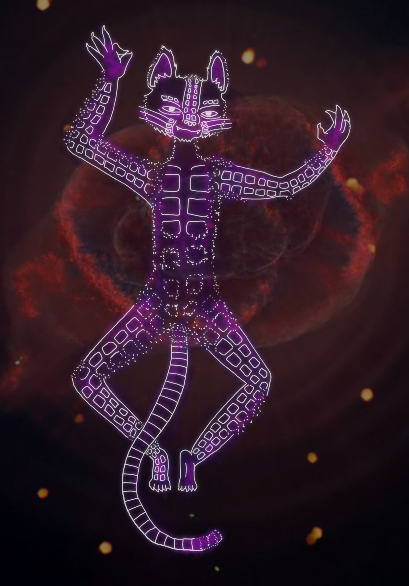

# Chases the Stars Across the Tumultuous Seas

**Chases the Stars Across the Tumultuous Seas** is a co-captain of the [Friend Ship III](../fleet/friend-ship.md). They share a body with their astral self Syzygy.

<figure>
  
  <figcaption>Chases the Stars by <a href="https://mario.panighetti.net">Mario Panighetti</a></figcaption>
</figure>

## Information

### Mental

- titles: Captain
- aliases: Chases the Butterflies Around the Steadfast Trees (childhood name), Chase (common nickname amongst non-tabaxi)
- classes: monk (Warrior of the Astral Self) / ranger (Beast Master)
- pronouns: they/them
- languages: Common, Draconic, Goblin, Infernal

### Physical

- Species: tabaxi
- Height: 5'0"
- Weight: 90 lb.
- Fur: tawny with ocelot patterns
- Eyes: yellow
- Birthday: 28 Vroi, 960

## Relationships

### [Steadfast Trees](../../steadfast-trees/steadfast-trees.md)

- Gnarled Root Anchoring the Steadfast Trees Against the Churning Waves: tribe leader and shaman
- Reeds in the Shallows, Sheltered by the Steadfast Trees: birth mother
- Poison Quills, Healing in the Shade of the Steadfast Trees: childhood friend and rival
- Walks Daily the Shores Embracing the Steadfast Trees: mentor

### Friend Ship III

- [Isari Plainleaf](isari-plainleaf.md): co-captain
- Syzygy: astral self
- Wavering Thoughts of the Adamantine Reef: beast companion

## History

### The Steadfast Trees

Chases the Butterflies Around the Steadfast Trees was the smallest of a litter of tabaxi. Their equivalent of a surname was given to denote their connection to the Steadfast Trees tribe, a name shared with their jungle island (as was common to all members of the tribe), while they were later called "Chases the Butterflies" to denote their aloof nature, as they always wished to pursue whatever caught their eye. Even a single butterfly fluttering past was enough to pull their attention from their duties, much to the chagrin of their elders.

But despite the hopes and wishes of the tribe, their name was not a sufficient descriptor. Rather than be content to pursue wandering insects, Chases the Butterflies' ambitions grew alongside their physical ability. They soon graduated to following the music of songbirds, then running alongside deer of the forest, then leaping down from great heights alongside the diving of the osprey into the deep pools hidden from view by jungle vines as they caught fish. At times, a day could not pass without Chase's peers coming up with updated names, then seeing them graduate to a new topic of interest.

### Call of the Stars

One day, as occasionally happens with catfolk, a trait of the Cat Lord manifested within Chase: eternal wanderlust. No longer content with the butterflies, they became transfixed by the very stars as they traversed the sky. They would follow this celestial procession every night from one end of their island to the other. To Chase, they seemed to plunge into the sea at the horizon, and they wished for nothing more than to see where they ended up. Chase knew then that the only course of action was to pursue the stars for all their days.

The People of the Steadfast Trees were saddened by Chase's decision, but they also knew it to be the only correct one. Chase's heart had always drawn them to explore, and their people knew that a tabaxi must follow their heart at all costs. They were granted a rare gift among their people, who did not normally covet personal possessions: a butterfly pendant to remind them to always find beauty in the simple things and to not forget their humble origins, carved from the wood of the tallest of the Steadfast Trees to keep them anchored to the source of life and protection of their tribe, with a spotted pattern in the wings made of platinum and electrum to represent their eternal pursuit of the heavens. With one final tribal ceremony, they were renamed "Chases the Stars Across the Tumultuous Seas", given a boat, and sent off to find their destiny.

### A Pirate's Life

### Hellish Rebuke

### Astral Self

<figure>
  
  <figcaption>Syzygy by <a href="https://mario.panighetti.net">Mario Panighetti</a></figcaption>
</figure>

### Love Lost

### Current

<figure>
  
  <figcaption>Chase and Kitty by Haru</figcaption>
</figure>
