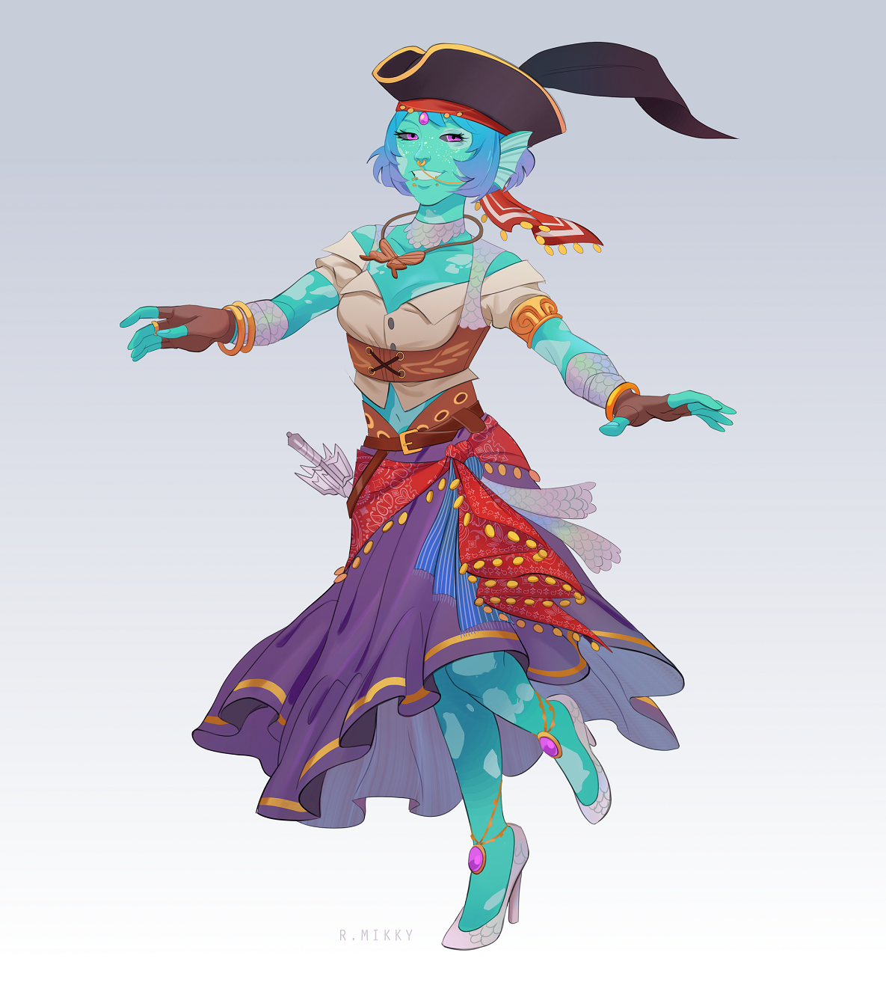
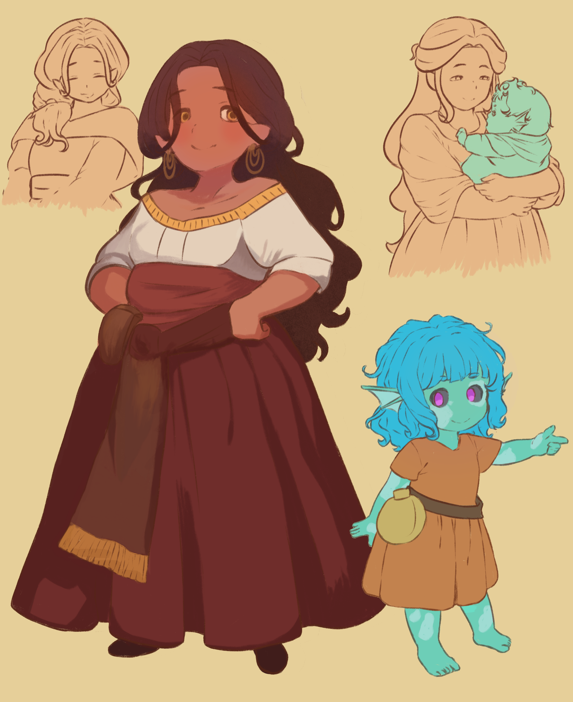
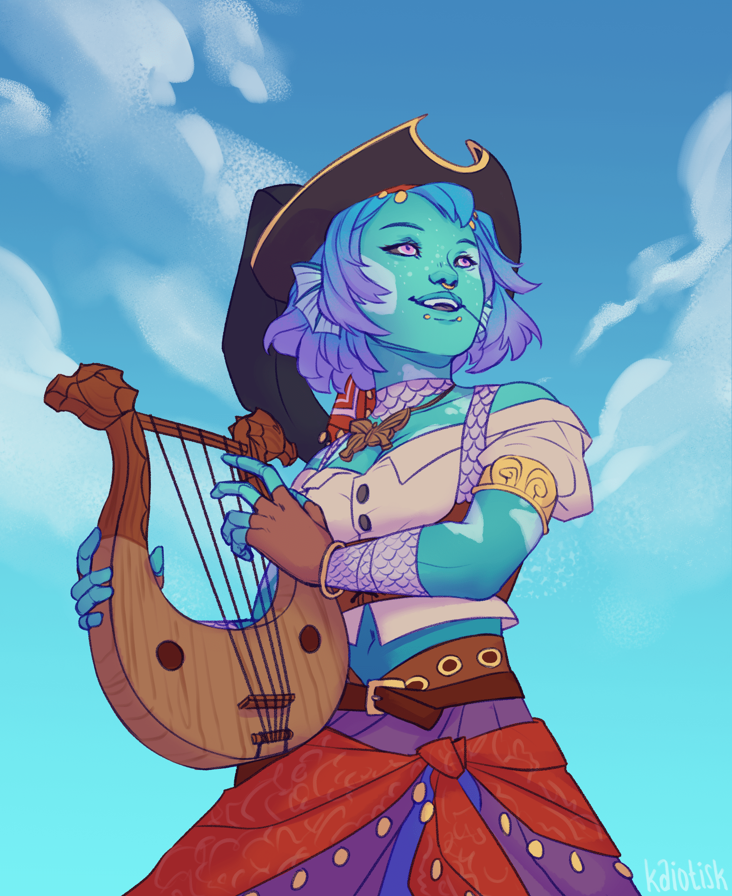

# Isari Plainleaf

<figure>
  
  <figcaption>Isari Plainleaf by <a href="https://linktr.ee/R.Mikky">R.Mikky</a></figcaption>
</figure>

## Attributes

- title: Pirate Lord (representing the crew of the [Friend Ship III](../fleet/friend-ship.md))
- Race: Water Genasi, Halfling
- classes: Bard (College of Glamour), Warlock (Friendship Patron)
- Pronouns: She/Her
- Languages: Common, Primordial

## Relationships

- Calda Plainleaf (Mother)
- Jekesh the Dutiful/Rashid Seaskimmer (Father)
- Ziyithai (Aunt)
- Relkul (half-brother)
- Ithai (Aunt)
- Ezkix (Aunt)
- Chase's the Stars across the Tumultous Seas (Ex?)
- The Friendship III (friends!)

## About

Isari is the common-man's no-body, called to adventure the seas from her home north of Northpoint, and is currently an acting Pirate Lord and co-captain of the Friendship III, as well as previously a champion of the Arch-Devil Zariel.

## Before the Seas

`Art depicts Calda Plainleaf and Isari as a child, drawn by myself (Tea)`

  

Isari Plainleaf was born and raised in Northpoint, a small port and the only town on an un-named Island to the west, it's only resounding feature being its proximity to the Adamantine Reef. Ironically, despite its name, the town was actually situated at the south end of the island. Her mother was a warm Halfling woman, Calda Plainleaf, Northpoint's resident and well respected seamstress, and her father was unknown - she never felt any need to go out of her way to learm much about him, only that he was a good man, surrounded as she was by years of trinkets and memories her mother had brought with her from her youth when she'd settled in Northpoint, as well as the small but energetic environment of the town.

It was quite a shock when she came out, considering she had the ears of a Mer, and was notably larger than your average Halfling babe. That, and the fact that, well...she was blue. This difference in appearance meant little to the community though, as she was accepted into it as if she were one of their own, with being raised in a loving household, she had little to wish for. There was one old man living in the lighthouse that didn't quite seem to like her, not for lack of trying on her part.

But alas, Isari was raised to learn the seamstress trade, but she always found herself drifting naturally to the art of music, singing or playing any instruments she could get her hands on, and she became a common visitor to the tavern, dancing along to the bard-songs, trading partner's on the floor long into the night. She never cared to understand why she was so different to these people with skin ranging between shades of polished marble to beautiful obsidian, nor would she question why, as the night would end, she would find herself drifting without purpose towards the beach, staring out at how the stars sparkled on the water.

She only ceased her late nights in her early adult years when her mother fell sick, traded her music for medicine as she took the task of staying up into the night to help care for her, spending most of her time sitting beside Calda's bed, singing her to sleep so she could rest despite her sickness. In this time, she'd oft find her eyes drift towards a beautiful harp her mother kept on propped up on her bedside table, carved out of smooth wood, the tops curved into matching Leviathan heads. That pull would become too much for Isari one night, able to hear her heart over Calda's laboured breathing as she would reach over and grab the harb, and began to pluck at the strings. The music it made was beautiful, but all she could see in her mind eye was night sea lapping against the beach. Once she re-opened her eyes, slowing her playing, she was shocked to see her mother sitting up, looking much healthier than she had in weeks.

She learned that night about her father, a handsome sailor who had dropped into port nineteen odd years ago, planning to leave after three days, but ended up staying for seven months. About how she had loved him, how they'd loved eachother, but that he was a soul that desired wanderlust, a spirit that couldn't be tied down. That this harp was a gift left behind by him, hand crafted, as he knew how Calda loved the sound of music. And about how, eight months after he'd left, she'd given birth to Isari.

Once she'd finished, Calda took Isari's hands gently in hers, and told her; "I recognize that light in your eyes, love. Go."

And so our future pirate captain did just that, giving her tearful goodbyes before hitching a ride on a sailor's ship a week later, headed towards Portmagne Island, where she'd begin to make herself a name within sailing communities and pirates both as a hitchhiker, and where, after a year, would find herself in possession of an invite to a certain Pirate Lord's banquet.

  
